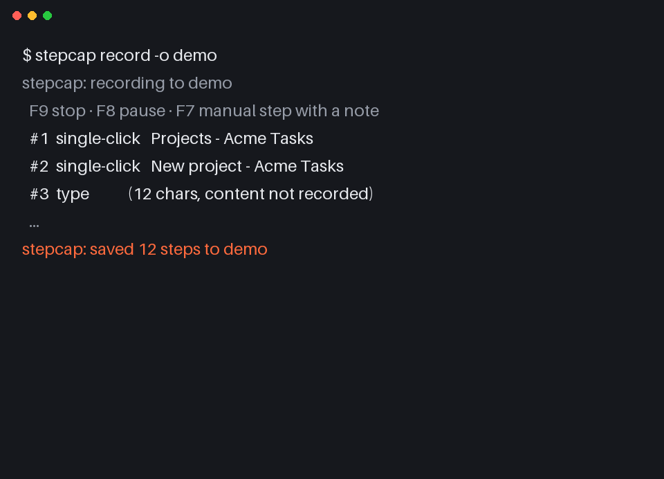
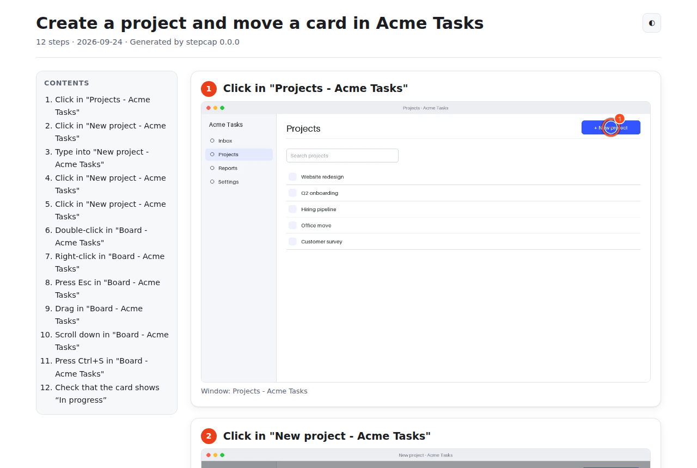
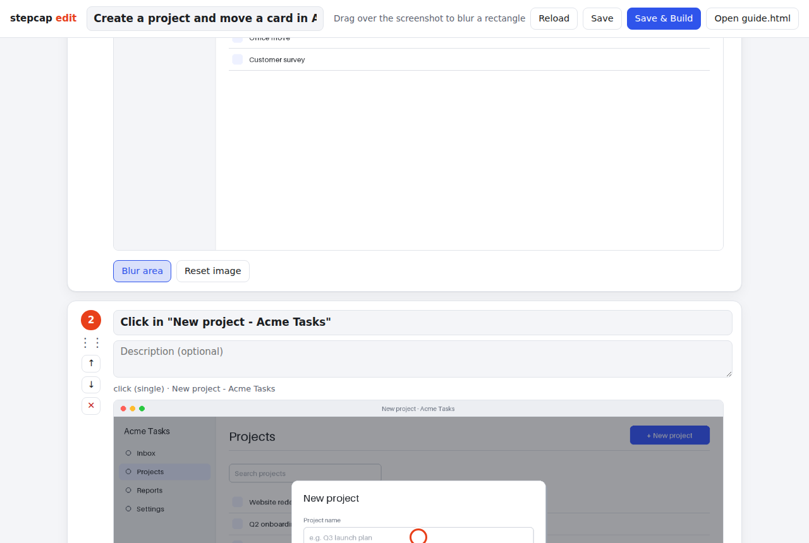
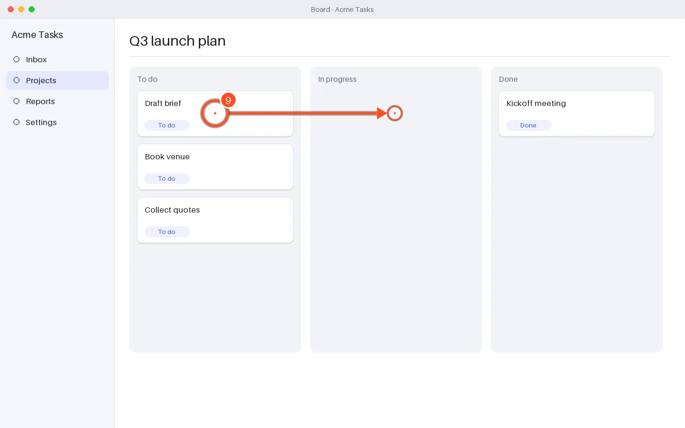
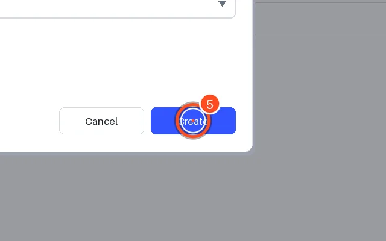

# stepcap

**画面操作を記録するだけで、クリック位置に番号付きマーカーを描いたスクリーンショット付きの手順書（Markdown / 単一 HTML）を自動生成します。**

`ローカル完結 · クラウド不要 · アカウント不要 · デスクトップ全体`

[](https://github.com/kajisho5/stepcap/actions/workflows/tests.yml)
[](https://github.com/kajisho5/stepcap/actions/workflows/codeql.yml)
[](https://pypi.org/project/stepcap/)
[](https://pypistats.org/packages/stepcap)
[](https://github.com/kajisho5/stepcap/stargazers)
[](https://github.com/kajisho5/stepcap/commits/main)
[](.github/workflows/tests.yml)
[](LICENSE)

*Scribe / Tango のようなツールを、オープンソース・デスクトップ全体対応・オフラインで。*
情シス、ヘルプデスク、総務、講師など「操作マニュアル」を作る人向けです。作業を 1 回やって F9 を押せば、手順書ができあがります。

[English README](README.md)

## クイックスタート

```bash
pipx install stepcap          # または pip install stepcap（Python 3.11 以上）
stepcap doctor                # 権限・フックを確認し、足りない設定の手順を表示
stepcap record -o my-guide    # 操作する → 終わったら F9
stepcap build my-guide --lang ja   # my-guide/guide.md, guide.html, steps.json
```

`my-guide/guide.html` は画像込みの 1 ファイルなので、そのままメール添付できます。Ctrl+P →「PDF に保存」で PDF にもなります。`guide.md` と `images/` は GitHub / Notion / Confluence に貼り付けられます。

記録中のキー: **F9** 停止 · **F8** 一時停止 / 再開 · **F7** メモ付きの手動ステップ（`--hotkey-stop ctrl+alt+s` のように変更可能）

Python を入れたくない場合は、[Releases](https://github.com/kajisho5/stepcap/releases) から Windows / macOS / Linux 用の単体実行ファイル（PyInstaller 製）を使えます。

## デモ



| 生成された `guide.html`（ライト / ダーク、目次、印刷用 CSS） | `stepcap edit`（並べ替え・改名・ぼかし） |
|---|---|
|  |  |

クリック位置には番号付きの二重リングを描きます。ドラッグには矢印、スクロールには方向矢印、ショートカットにはキーラベルが付きます。`--zoom 640` を指定するとクリック周辺の切り抜きがメイン画像になり、全画面のサムネイルが添えられます。

| 全画面 | `--zoom 640` |
|---|---|
|  |  |

上の画像はすべて [`demos/build.py`](demos/build.py) が合成セッション（`stepcap simulate`）から生成しています。実データは含まれず、いつでも再生成できます。

## できること

- **デスクトップ全体を記録**（ブラウザに限定されません）: クリック（シングル / ダブル / 右）、ドラッグ、スクロール（連続操作は 1 ステップに集約）、文字入力、Enter / Esc、Ctrl+S などのショートカット、F7 の手動メモ。マルチモニタと HiDPI / Retina に対応
- **ステップごとにスクリーンショット**: カーソルのあるモニタを撮影（`--monitor all` で全画面）。撮影は押下時なので、クリックで画面が変わる前の状態が残ります。保存は別スレッドで行い、クリック→保存の遅延を計測・記録します（目標 < 300 ms）
- **自動タイトル**: ウィンドウ名から `「設定」でクリック`、`「請求書 - Excel」に入力` のように付けます（`--lang ja` / `en`）
- **同じ画面は画像を再利用**: 連続するステップの画面が 98% 以上同じなら 1 枚を共有するので、ぼかしも 1 回で全ステップに反映されます
- **出力**: `guide.md` + `images/`、単一ファイルの `guide.html`（目次・ライト / ダーク・印刷 CSS）、編集用の正本 `steps.json`
- **再ビルドしても編集を上書きしない**: 人・`stepcap edit`・AI エージェントが `steps.json` に加えた編集は保持されます（最初から作り直すときは `--reset`）
- **ローカル編集 UI**（`stepcap edit`）: ドラッグで並べ替え、削除、タイトル / 説明の編集、矩形ぼかし（`work/` のコピーに適用し、原本 `raw/` は変更しません）、再ビルド
- **プライバシー重視の初期設定**: `--record-typing` を付けない限り入力内容は保存しません。パスワード / ログイン画面では常にマスクします。`--exclude-app` を指定したアプリが前面の間は記録もスクショもしません。通信は一切行いません

### できないこと（v0.1）

- **Wayland**（Linux）には非対応で、X11 のみです。Wayland では理由を表示して停止します
- **OCR / AI による命名**はしません。タイトルはウィンドウ名ベースです。人が読みやすい文章にしたい場合は後述の Agent Skill を使ってください
- **動画**、ナレーション、クラウド共有、チーム管理
- PDF の直接出力（`guide.html` をブラウザで印刷 → PDF）

## 他ツールとの比較

各社の公開情報に基づきます（2026-09-24 時点で確認。価格は変わるため各リンクを参照してください）。

| | OSS | 記録対象 | 動作環境 | アカウント / クラウド | 価格 |
|---|---|---|---|---|---|
| **stepcap** | ✅ MIT | デスクトップ全体 | Windows / macOS / Linux(X11) | 不要・完全ローカル | 無料 |
| [Scribe](https://scribe.com/pricing) | — | ブラウザ（Pro はデスクトップアプリも） | 拡張機能 + デスクトップアプリ | 必要・クラウド | Basic 無料、Pro Personal $25/ユーザー/月（年払い） |
| [Tango](https://www.tango.ai/pricing) | — | ブラウザ（拡張機能） | ブラウザ | 必要・クラウド | 無料、Pro $22/ユーザー/月（年払い・1〜2 名） |
| [FlowShare](https://getflowshare.com/pricing/) | — | デスクトップ全体 | Windows | ライセンス | Professional $44/月（年払い）、$49（月払い） |
| [Guidde](https://www.guidde.com/) | — | 動画ガイド（AI ナレーション） | 拡張機能 / デスクトップ / モバイルアプリ | 必要・クラウド | 公式サイト参照 |
| [CliqRelay](https://github.com/CliqRelay/cliqrelay) | ✅ | ブラウザ（Chrome 拡張） | セルフホスト型プラットフォーム（Web アプリ + バックエンド） | セルフホスト | 無料 |
| [Windows ステップ記録ツール](https://support.microsoft.com/en-us/windows/apps/steps-recorder-deprecation) | — | デスクトップ全体 | Windows | 不要 | OS 標準機能だが Microsoft が**非推奨化** |

## コマンド

```text
stepcap record [-o SESSION_DIR] [--monitor all|active] [--record-typing]
               [--exclude-app NAME ...] [--hotkey-stop F9] [--hotkey-pause F8]
               [--hotkey-manual F7] [--note-prompt auto|gui|terminal|none] [--dry-run] [--json]
stepcap build SESSION_DIR [-f md,html] [--zoom 800] [--width 1600] [--lang en|ja]
              [--title "..."] [--image-format webp|jpeg|png] [--quality 85] [--reset]
              [--dry-run] [--json]
stepcap edit SESSION_DIR [--port 8765] [--host 127.0.0.1] [--no-browser]
stepcap simulate EVENTS.json -o SESSION_DIR [--record-typing] [--json]
stepcap doctor [--json]
```

失敗時はすべて非ゼロで終了します。`--json` で機械可読な出力になります。既存の空でないセッションフォルダは上書きせず、`build` は `raw/` に一切触れません。

## 権限

足りない設定は `stepcap doctor` が具体的に表示します。概要は次のとおりです。

- **macOS**: ターミナルアプリに「アクセシビリティ」「入力監視」「画面収録」を許可し、アプリを再起動
- **Windows**: 許可操作は不要です。ただし管理者として実行したウィンドウの操作は、stepcap も管理者として起動しないと記録できません
- **Linux**: X11 セッションが必要です（Wayland 不可）。`xdotool` を入れるとウィンドウ名の取得が安定します（任意）

詳細: [docs/permissions.md](docs/permissions.md)

## Agent Skill: 手順の文章をコーディングエージェントに書かせる

自動タイトルはテンプレートベースです（`「設定」でクリック`）。Claude Code / Codex / Cursor にセッションフォルダを渡すと、エージェントが注釈付きスクリーンショットを見て各ステップのタイトルと 1〜2 文の説明を `steps.json` に書き、`stepcap build` まで実行します。手順は [`skills/stepcap/SKILL.md`](skills/stepcap/SKILL.md) にあります。

```bash
# Claude Code: ユーザー単位でスキルをインストール
mkdir -p ~/.claude/skills && cp -r skills/stepcap ~/.claude/skills/
# 依頼例:「./my-guide に stepcap スキルを使って日本語で手順を書いて」
```

エージェントが画像を直接読むため、OCR も API キーも不要です。

## FAQ

**どこかにアップロードされますか？** されません。stepcap は通信を一切行いません。編集 UI は 127.0.0.1 のみで待ち受け、Host / Origin も検査します。

**パスワードは記録されますか？** 既定では入力内容を保存せず、「12 文字入力」とだけ記録します。ただし画面に表示されている内容はスクリーンショットに写るので、`stepcap edit` でぼかすか、パスワードマネージャーを `--exclude-app` で除外してください。

**録画せずに試せますか？** 試せます: `python tests/fixtures/make_events.py > ev.json && stepcap simulate ev.json -o demo && stepcap build demo --lang ja`

**タイトルが「クリック」だけになります。** ウィンドウ名を取得できていません（`stepcap doctor` を実行してください。macOS では「画面収録」の許可が必要です）。`stepcap edit` で直すか、エージェントに書かせてください。

## ロードマップ

[ROADMAP.md](ROADMAP.md) を参照してください（OCR による命名、PDF 出力、portal 経由の Wayland 対応、マスキングプリセット、多言語化など）。予定の項目は `roadmap` ラベル付きの GitHub Issue で管理しています。

## ライセンス

[MIT](LICENSE)。実行時の依存は Pillow（MIT-CMU）、mss（MIT）、pynput（LGPL-3.0、無改変のライブラリとして利用）です。詳しくは [docs/THIRD_PARTY.md](docs/THIRD_PARTY.md) を参照してください。
