# Create a project and move a card in Acme Tasks

_12 steps · 2026-09-24 · Generated by stepcap 0.1.4_

## Step 1 — Click the "+ New project" button

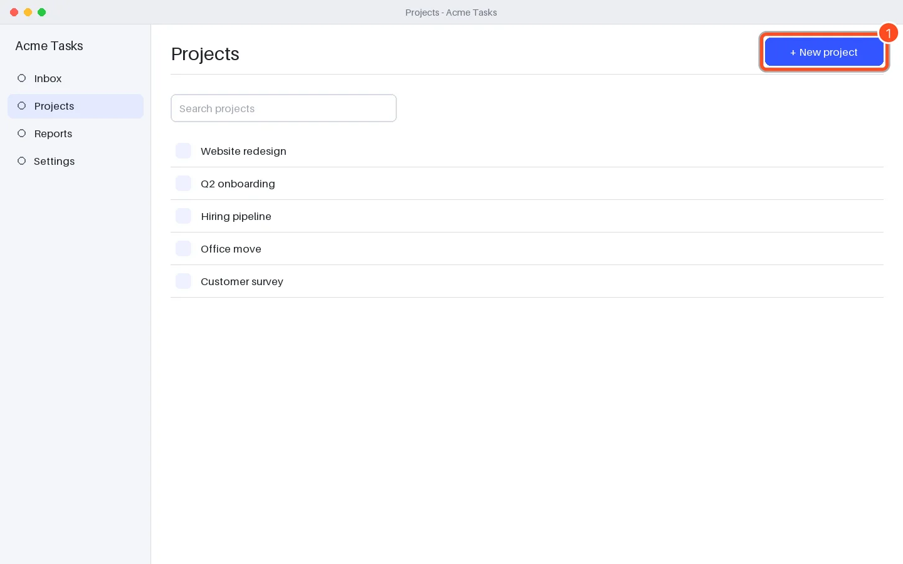

## Step 2 — Click the "Project name" field

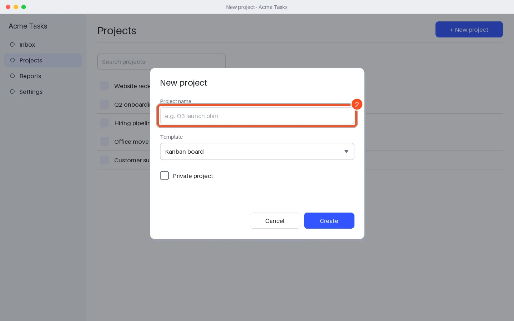

## Step 3 — Type into the "Project name" field

Typed 14 characters (content not recorded).

## Step 4 — Click the "Private project" checkbox

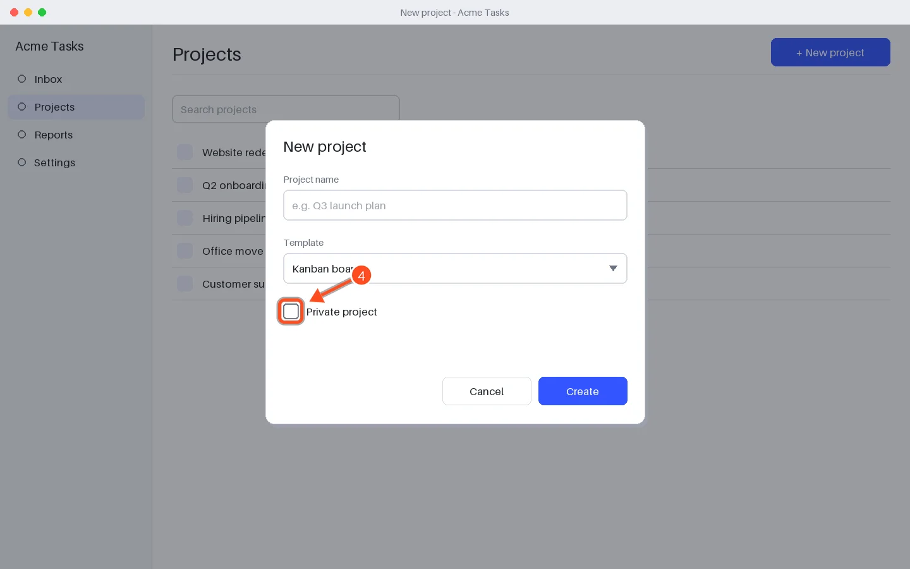

## Step 5 — Click the "Create" button

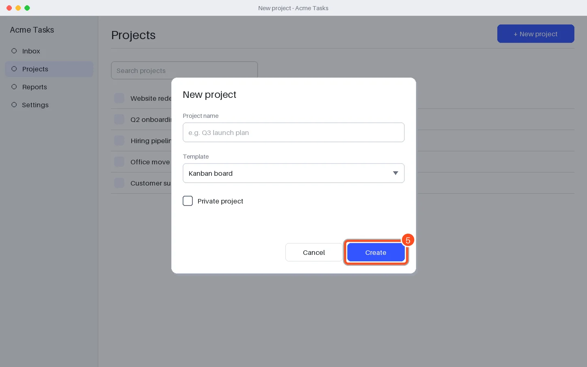

## Step 6 — Double-click "Book venue"

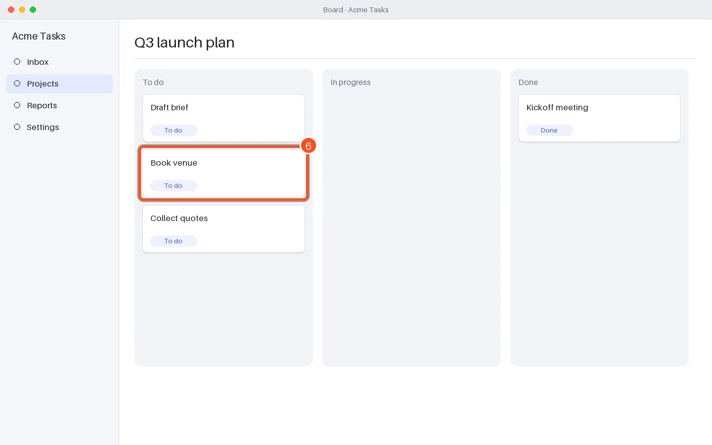

## Step 7 — Right-click "Draft brief"

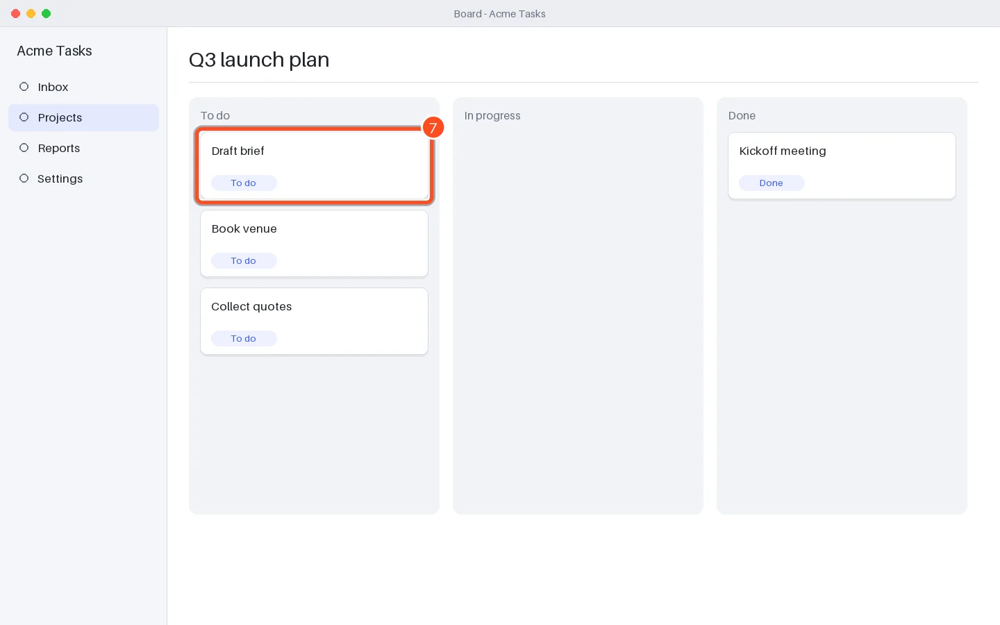

## Step 8 — Press Esc in "Board - Acme Tasks"

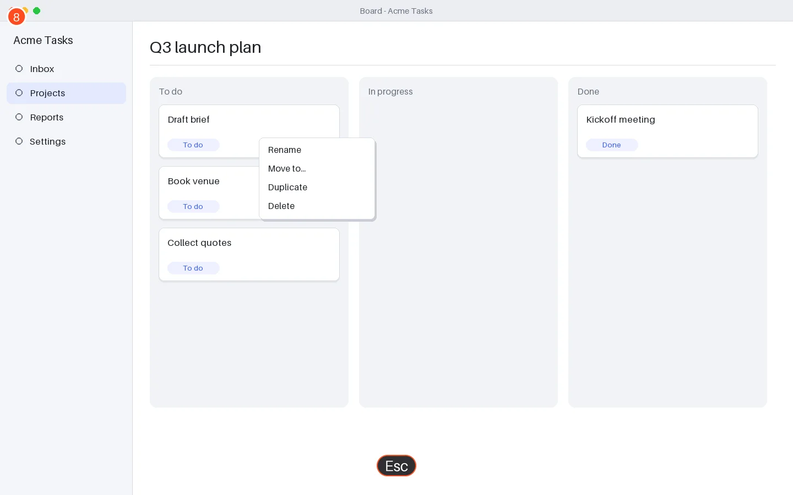

## Step 9 — Drag "Draft brief"

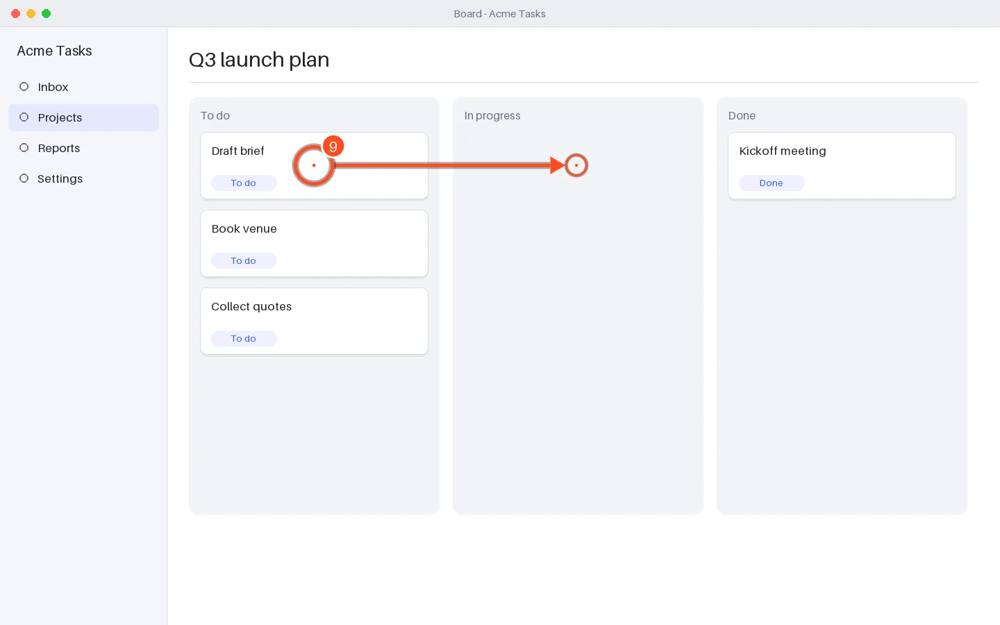

## Step 10 — Scroll down in "Board - Acme Tasks"

Scrolled down (3 notches).

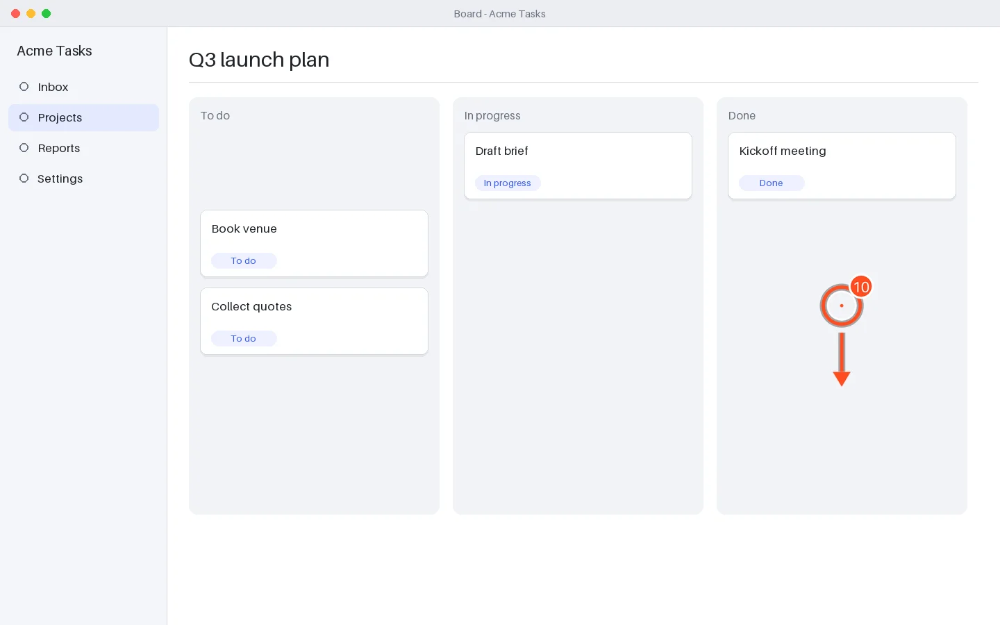

## Step 11 — Press Ctrl+S in "Board - Acme Tasks"

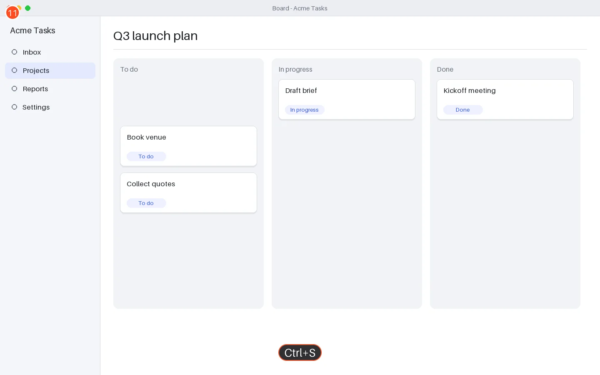

## Step 12 — Check that the card shows “In progress”

The card moves to the In progress column and the team is notified.

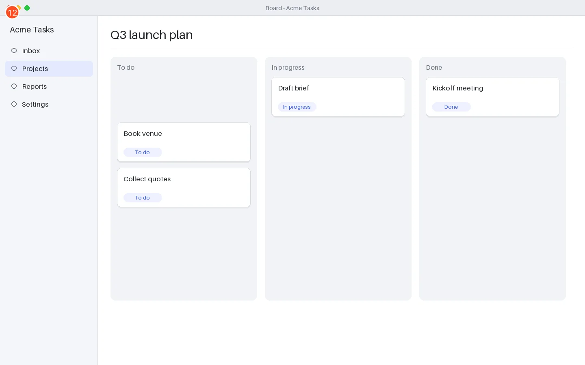
